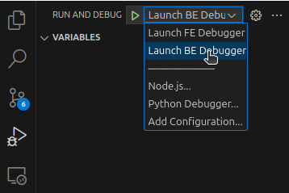
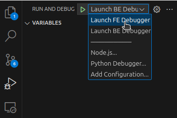

# How to run
This section assumes you are using [Microsoft Visual Studio Code](https://code.visualstudio.com/download).

To set up and run the Zone Detection Sample Application, follow the instructions in the relevant sections:
- [Preparing devices on AITRIOS](https://github.com/SonySemiconductorSolutions/aitrios-sample-application-reference/tree/main?tab=readme-ov-file#prepare-a-device-on-aitrios-console).
- [Starting the backend](https://github.com/SonySemiconductorSolutions/aitrios-sample-application-reference/blob/main/backend/README.md#usage), for both _Production_ and _Development_ modes, including debugging instructions.
- [Starting the frontend](https://github.com/SonySemiconductorSolutions/aitrios-sample-application-reference/blob/main/frontend/README.md#usage), for both _Production_ and _Development_ modes.


## Dev container
This repository supports running as a development container (dev container), allowing you to use a containerized environment (e.g., a Docker container) for development. The dev container setup in this repository starts both the frontend and backend automatically.

However, as of the writing of this document, the dev container in this repository lacks certain features, such as debugging support. While it can be used for development, its primary purpose is to provide a quick and easy way to start the application for testing purposes.

You can run the dev container in two ways:
- **GitHub Codespaces**: Run the application in a cloud-based virtual machine. See [GitHub Codespaces documentation](https://docs.github.com/en/codespaces/developing-in-a-codespace/developing-in-a-codespace).
- **Visual Studio Code**: VS Code natively supports dev containers, allowing you to develop inside the container. This makes it easy to test changes in a consistent environment. See [VS Code dev container documentation for setup instructions](https://code.visualstudio.com/docs/devcontainers/containers).

## Debugging
You can debug both BackEnd and FrontEnd, both separatedly or at the same time. The instructions on how to run each type of debugging are below.

At the time of writing this document `dev container` does not support debugging.

### Backend

Start by setting the environment variable `DEBUGGER` to "_True_". You can do so by running the following command in the terminal, **before** starting the backend:
```bash
export DEBUGGER=True
```
Then, make sure to start the backend application with a development environment as explained in [here](../backend/README.md#development).

You can then execute the debugging process in Visual Studio Code as follows:

1. Select the _Run and Debug_ item of the activity bar (`Ctrl+Shift+D` keyshortcut).
2. Choose the _Launch BE Debugger_ option as seen below.

    

### Frontend
Make sure the frontend application has been started with a development environment as explained in [here](../frontend/README.md#development-environment).

You can then execute the debugging process in Visual Studio Code as follows:

1. Select the _Run and Debug_ item of the activity bar (`Ctrl+Shift+D` keyshortcut).
2. Choose the _Launch FE Debugger_ option as seen below.

    

3. This will open a new browser window with the Zone Detection application, so make sure you are using the right window when debugging.
