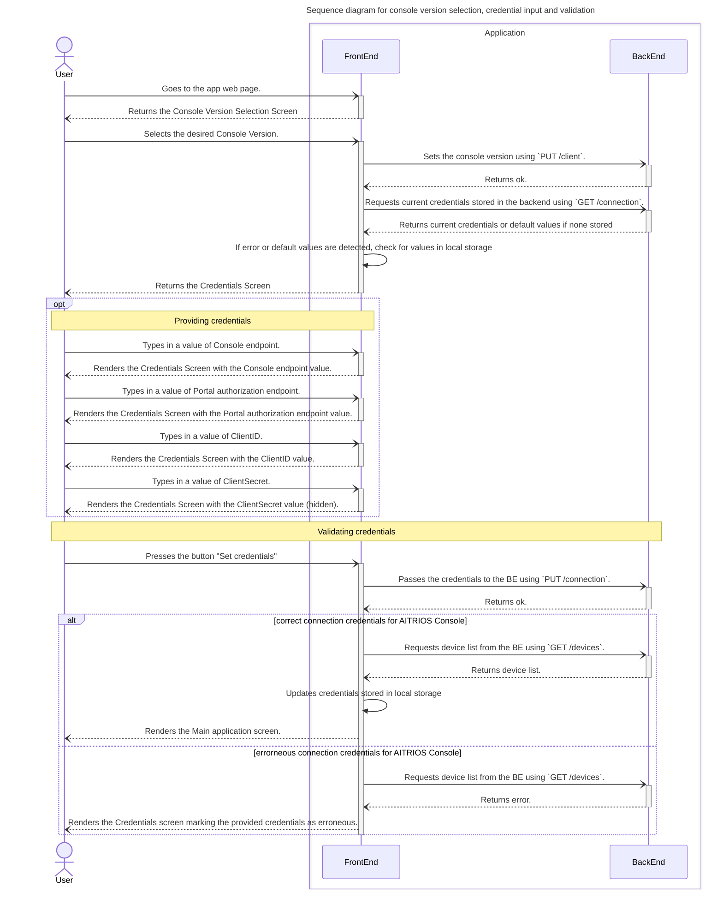

# Credentials screen

This is the screen to configure the settings to connect to the selected Console project.

```mermaid
---
title:  Sequence diagram for console version selection, credential input and validation
---
sequenceDiagram
    actor U as User
    box Application
    participant F as FrontEnd
    participant B as BackEnd
    end
  U -)  +F: Goes to the app web page.
  F --) -U: Returns the Console Version Selection Screen
  U -)  +F: Selects the desired Console Version.
    F -) +B: Sets the console version using `PUT /client`.
    B --) -F: Returns ok.
    F -) +B: Requests current credentials stored in the backend using `GET /connection`.
    B --) -F: Returns current credentials or default values if none stored
    F ->> F: If error or default values are detected, check for values in local storage
  F --) -U: Returns the Credentials Screen

  opt
    Note over U, F: Providing credentials
    U -)  +F: Types in a value of Console endpoint.
    F --) -U: Renders the Credentials Screen with the Console endpoint value.
    U -)  +F: Types in a value of Portal authorization endpoint.
    F --) -U: Renders the Credentials Screen with the Portal authorization endpoint value.
    U -)  +F: Types in a value of ClientID.
    F --) -U: Renders the Credentials Screen with the ClientID value.
    U -)  +F: Types in a value of ClientSecret.
    F --) -U: Renders the Credentials Screen with the ClientSecret value (hidden).
  end

  Note over U, B: Validating credentials
  U -) +F: Presses the button "Set credentials"

  F -)  +B: Passes the credentials to the BE using `PUT /connection`.
  B --) -F: Returns ok.

  alt correct connection credentials for AITRIOS Console
  F -)  +B: Requests device list from the BE using `GET /devices`.
      B --) -F: Returns device list.
      F ->> F: Updates credentials stored in local storage
    F --) U: Renders the Main application screen.

  else errorneous connection credentials for AITRIOS Console
  F -)  +B: Requests device list from the BE using `GET /devices`.
      B --) -F: Returns error.
    F --) U: Renders the Credentials screen marking the provided credentials as erroneous.
  end
  deactivate F
```
