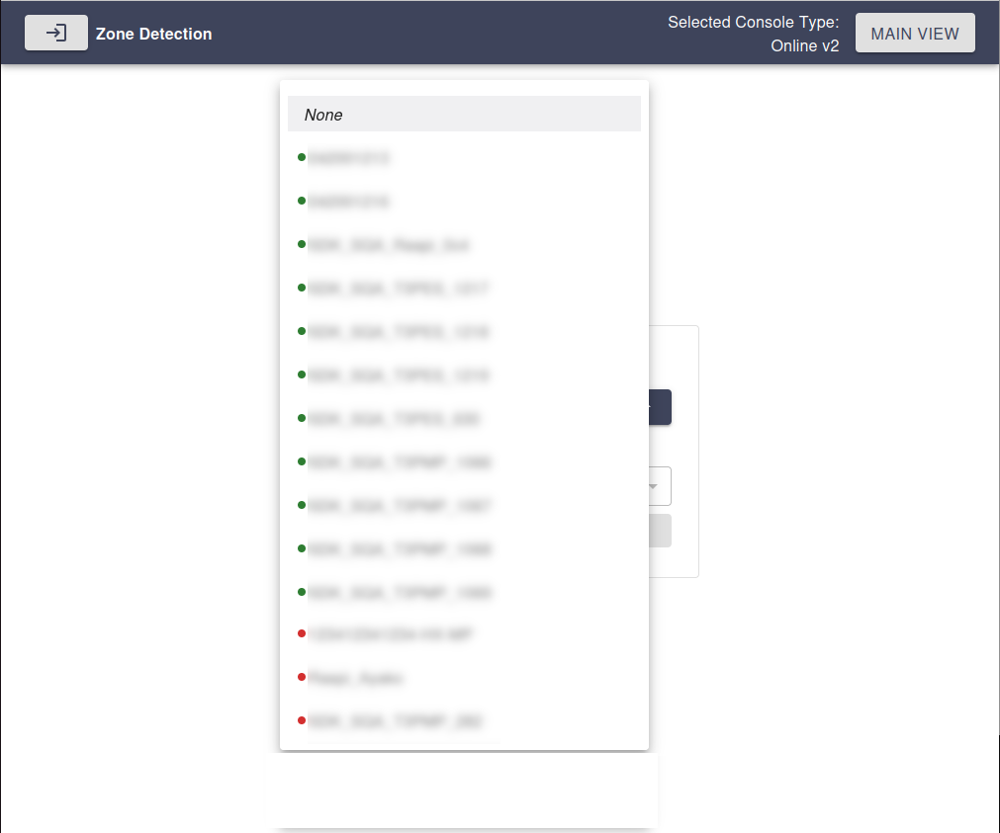

# Expected User Workflow

## 1. Open the Application
Follow the [USAGE.md](USAGE.md) guide to start the application.

## 2. Select AITRIOS Online Console Version
Upon launching, the landing page will prompt the user to select the AITRIOS Online Console version to use.

## 3. Enter Console Credentials
Once a console version is selected, the user must enter their credentials. Click **Apply** to submit the credentials.

## 4. Select Device and Model
After successful authentication, the user can choose:
- A **device** from the list of enrolled devices in the project.
- A **model** available on the selected device.

Click **Apply** to proceed to the **Zone Detection** main view.

## 5. Zone Detection Main View
On the main page, users have multiple configuration options:

1. **Reconfigure** device and model selection via the **"Configure"** button.
2. **Select a zone** to filter detections using the **"Select Zone"** button.
3. **Adjust parameters** with sliders and value input boxes.
4. **Access extra settings** using the ⚙️ button.
5. **Enable or disable image reception** using the **"Send Image"** checkbox.
6. **Start inference on device** using **Start inference**.
7. **Change the graph visualization** using the **three dots** button.

## 6. Start Inference
To begin inference, click the **Start Inference** button.

